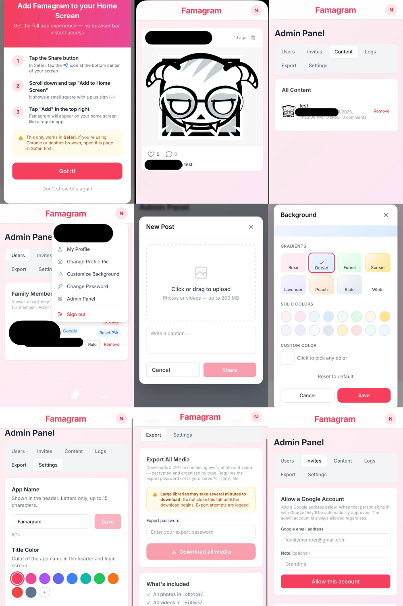

# Famagram

A private, self-hosted photo and video sharing app for families and small groups. All media is encrypted at rest. No third-party cloud storage — everything stays on your server.

---

## Features

- Photo and video sharing feed
- Short-video "Vids" page (TikTok-style vertical scroll)
- Likes and comments on all posts
- Profile pages with custom avatars
- Per-user customizable background themes
- Admin panel: user management, invite links, content moderation, media export
- Three user roles: Poster, Reader, Viewer
- Login with email/password or Google OAuth
- Admin-generated password reset links
- Add to Home Screen on iOS and Android (works as a PWA)
- All photos and videos encrypted at rest with AES-256-GCM
- Content blurs automatically when you switch apps (privacy screen)
- Customizable app name (up to 15 letters, set in Admin > Settings)

---

## Screenshots

<div align="center">
  <h4>Famagram Options Preview</h4>
  
</div>

---

## Requirements

- [Docker Desktop](https://www.docker.com/products/docker-desktop/) (Mac, Windows, or Linux)
- That's it. Docker pulls everything else automatically.

---

## Quick Start (Recommended — pre-built images)

This is the easiest way to run Famagram. You do **not** need to download the source code.

### 1. Download the two required files

Save these two files into a folder on your machine (e.g. `famagram/`):

- [`docker-compose.deploy.yml`](docker-compose.deploy.yml)
- [`.env.example`](.env.example)

### 2. Create your configuration file

Rename `.env.example` to `.env`:

```bash
cp .env.example .env
```

On Windows, just rename the file in Explorer.

### 3. Fill in the required values

Open `.env` in any text editor and set:

| Variable | What to put |
|---|---|
| `POSTGRES_PASSWORD` | Any strong password for the database (you won't type this regularly) |
| `SESSION_SECRET` | A long random string — run `node -e "console.log(require('crypto').randomBytes(64).toString('hex'))"` or use any 64+ character random string |
| `ENCRYPTION_KEY` | A 64-character hex string — run `node -e "console.log(require('crypto').randomBytes(32).toString('hex'))"` |
| `ADMIN_EMAIL` | Email for the auto-created admin account |
| `ADMIN_PASSWORD` | Strong password (20+ chars, upper, lower, number, symbol) |
| `FRONTEND_URL` | Where people will access the app (see below) |

**Setting `FRONTEND_URL`:**
- Running on your own laptop: `http://localhost`
- Running on a home server (Raspberry Pi, NAS, etc.): `http://192.168.1.x` (your server's local IP)
- Running on a public server with a domain: `https://photos.yourfamily.com`

> **IMPORTANT — Back up your `.env` file**, especially `ENCRYPTION_KEY`. All photos and videos are encrypted with this key. If you lose it, your media is permanently unrecoverable.

### 4. Start the app

```bash
docker compose -f docker-compose.deploy.yml up -d
```

Docker will download the images (first run takes a few minutes depending on your connection) and start four containers: the database, backend API, frontend, and nginx proxy.

### 5. Open the app

Go to your `FRONTEND_URL` in a browser (default: [http://localhost](http://localhost)).

Sign in with the `ADMIN_EMAIL` and `ADMIN_PASSWORD` you set in `.env`.

> Change the admin password after your first login — go to the profile icon > Change Password.

---

## Useful Commands

```bash
# Check if containers are running
docker compose -f docker-compose.deploy.yml ps

# View logs (all services)
docker compose -f docker-compose.deploy.yml logs -f

# View logs for one service (backend, frontend, nginx, postgres)
docker compose -f docker-compose.deploy.yml logs -f backend

# Stop the app
docker compose -f docker-compose.deploy.yml down

# Stop and delete all data (irreversible)
docker compose -f docker-compose.deploy.yml down -v

# Update to the latest version
docker compose -f docker-compose.deploy.yml pull
docker compose -f docker-compose.deploy.yml up -d
```

---

## Inviting Family Members

1. Log in as an admin.
2. Tap the gear icon (Admin Panel) in the bottom nav.
3. Go to the **Invites** tab and create an invite link.
4. Share the link with the person — they click it, fill in their name, email, and password, and their account is automatically approved.
5. You can set their role before or after they register (Users tab).

---

## User Roles

Managed in **Admin Panel > Users**.

| Role | Can view | Can like/comment | Can upload |
|---|---|---|---|
| **Poster** | Yes | Yes | Yes |
| **Reader** | Yes | Yes | No |
| **Viewer** | Yes | No | No |

Admins have full access to everything including the admin panel, and cannot be removed unless another admin exists.

---

## Admin Panel

Access via the gear icon in the bottom navigation bar (admin accounts only).

| Tab | What it does |
|---|---|
| **Users** | Approve/reject pending accounts, change roles, reset passwords, remove users |
| **Content** | View and delete any post |
| **Invites** | Generate invite links for new members |
| **Logs** | Activity log (logins, uploads, admin actions) |
| **Settings** | Customize the app name (up to 15 letters) |

### Resetting a User's Password

1. Admin Panel > Users > find the user > click **Reset PW**
2. Copy the link and send it to the user
3. The link is valid for 24 hours and requires the user to enter their email to confirm

---

## Adding to Home Screen (iOS / Android)

Famagram works as a Progressive Web App (PWA) — it can be installed on a phone's home screen and behaves like a native app.

**iOS (Safari):**
1. Open the app in Safari
2. Tap the Share button (box with arrow)
3. Scroll down and tap **Add to Home Screen**
4. Tap **Add**

**Android (Chrome):**
1. Open the app in Chrome
2. Tap the three-dot menu
3. Tap **Add to Home Screen** or **Install App**

Once installed, the app launches fullscreen with no browser chrome, and the icon appears on your home screen.

---

## Google OAuth (Optional)

Instead of email/password login, you can use Google accounts.

1. Go to [https://console.cloud.google.com/](https://console.cloud.google.com/)
2. Create a project > APIs & Services > Credentials
3. Create an **OAuth 2.0 Client ID** (Web application type)
4. Add an **Authorized Redirect URI**: `https://yourdomain.com/api/auth/google/callback`
5. In your `.env` set:

```
AUTH_MODE=google
GOOGLE_CLIENT_ID=your_client_id_here
GOOGLE_CLIENT_SECRET=your_client_secret_here
GOOGLE_CALLBACK_URL=https://yourdomain.com/api/auth/google/callback
GOOGLE_ADMIN_EMAIL=your.google.email@gmail.com
```

`GOOGLE_ADMIN_EMAIL` is the Google account that automatically receives admin access on first login — set this to your own Google account.

---

## Media Export

Admins can download a ZIP of all photos and videos. To enable this feature, set a password in `.env`:

```
EXPORT_PASSWORD=a_strong_password_here
```

Leave it blank to disable export entirely. In the Admin Panel, go to **Content** and use the Export button.

---

## Backup and Restore

Two things need to be backed up:

### 1. The `.env` file
This contains your `ENCRYPTION_KEY`. Without it, all media is permanently unrecoverable. Back it up to a secure location (password manager, encrypted drive, etc.).

### 2. Docker volumes

```bash
# Back up the database
docker exec famagram-db pg_dump -U famagram famagram > backup_$(date +%Y%m%d).sql

# Back up uploaded media
docker run --rm \
  -v famagram_uploads_data:/data \
  -v $(pwd):/backup \
  alpine tar czf /backup/uploads_$(date +%Y%m%d).tar.gz -C /data .
```

**To restore:**

```bash
# Restore database
docker exec -i famagram-db psql -U famagram famagram < backup_YYYYMMDD.sql

# Restore media
docker run --rm \
  -v famagram_uploads_data:/data \
  -v $(pwd):/backup \
  alpine tar xzf /backup/uploads_YYYYMMDD.tar.gz -C /data
```

---

## Troubleshooting

**Containers won't start**
```bash
docker compose -f docker-compose.deploy.yml logs
```
Look for error messages. The most common cause is a missing or malformed `.env` value.

**Can't log in / "Not authenticated" errors**
- Make sure `SESSION_SECRET` is set in `.env` and is at least 32 characters
- Make sure `FRONTEND_URL` matches the address you're using in the browser exactly (including `http://` vs `https://`)

**Photos not loading / all media broken**
- Your `ENCRYPTION_KEY` may have changed. Media encrypted with a different key cannot be decrypted. Restore from backup.

**Port 80 already in use**
Add `PORT=8080` (or any free port) to your `.env`. Then access the app at `http://localhost:8080`.

**Database migration errors on startup**
The backend runs `prisma migrate deploy` automatically on startup. If a migration fails, check the backend logs:
```bash
docker compose -f docker-compose.deploy.yml logs backend
```

**Reset everything and start fresh**
```bash
docker compose -f docker-compose.deploy.yml down -v
docker compose -f docker-compose.deploy.yml up -d
```
This deletes all data including the database and uploaded media. Only do this on a fresh install.
